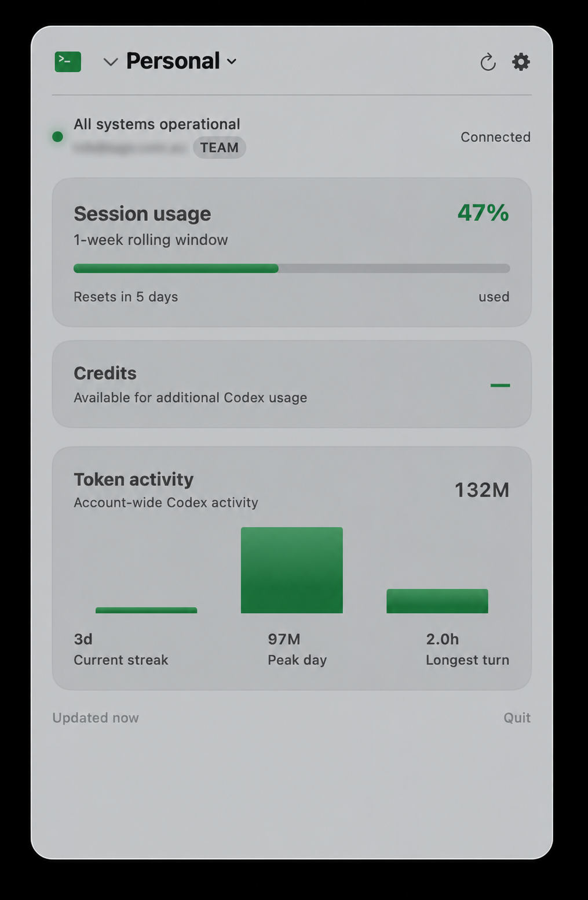
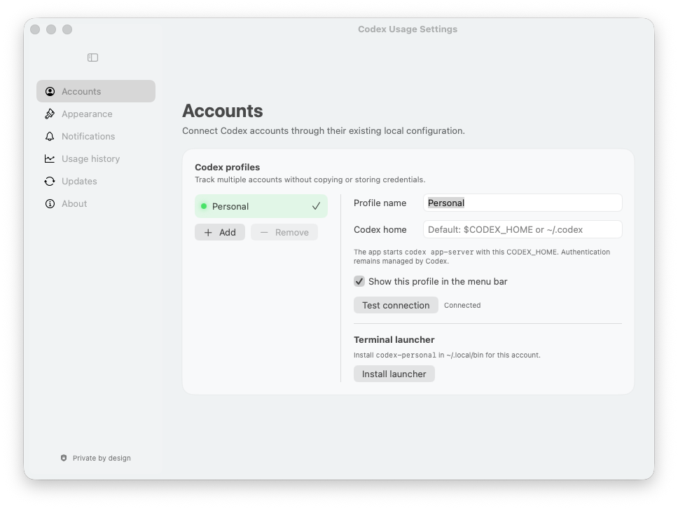

# Codex Usage Tracker

<p align="center">
  
</p>

<p align="center">
  <a href="https://github.com/Agend-Systems/codex-usage-tracker/releases/latest"></a>
  
  
  <a href="LICENSE"></a>
</p>

See your Codex limits, reset times, and usage history without leaving the macOS menu bar. Codex Usage Tracker is a native, signed and notarized app with multiple-profile support and no credential access.

It communicates only with the locally installed Codex CLI through the documented app-server protocol. Authentication remains managed by Codex: the app never reads, copies, or stores your tokens.

## Screenshots

<p align="center">
  
  &nbsp;
  
</p>

## Highlights

- Live session and weekly rolling-window usage, reset times, and plan information
- Account token activity with a 14-day chart, lifetime total, peak day, streak, and longest turn
- Multiple Codex profiles through separate `CODEX_HOME` directories
- Four compact menu-bar styles, including used or remaining percentage
- Local 90-day usage history with CSV export
- Configurable warning and critical notifications
- Credit balance and earned rate-limit reset support when the account provides them
- Per-profile `codex-<name>` terminal launchers
- OpenAI service-status indicator and launch-at-login support
- No analytics, credential extraction, private API calls, or cloud sync

## Requirements

- macOS 14 Sonoma or newer
- A recent [Codex CLI](https://developers.openai.com/codex/cli/) installation
- A ChatGPT account signed in through Codex

The app looks for `codex` in the process `PATH`, Homebrew locations, `~/.local/bin`, `~/.npm-global/bin`, and the Codex macOS app bundle.

## Install

### Homebrew

Install Codex Usage from the Agend Systems tap:

```sh
brew tap Agend-Systems/tap
brew install --cask Agend-Systems/tap/codex-usage
```

Install future releases with:

```sh
brew update
brew upgrade --cask codex-usage
```

### Manual installation

Download `Codex.Usage.app.zip` and its checksum from the latest [GitHub Release](https://github.com/Agend-Systems/codex-usage-tracker/releases/latest). Verify the download, then unzip the app and move it to Applications:

```sh
shasum -a 256 "Codex.Usage.app.zip"
# Compare this output with Codex.Usage.app.zip.sha256 from the same release.
unzip "Codex.Usage.app.zip"
mv "Codex Usage.app" /Applications/
```

Releases from version 0.1.3 are Developer ID signed and notarized by Apple, so they open normally after download. For version 0.1.2 and earlier, Control-click **Codex Usage.app**, choose **Open**, then confirm the macOS prompt on first launch.

## Build and run

```sh
git clone https://github.com/Agend-Systems/codex-usage-tracker.git
cd codex-usage-tracker
open "Codex Usage.xcodeproj"
```

Select the **Codex Usage** scheme and run it on **My Mac**. Command-line builds do not require signing:

```sh
xcodebuild \
  -project "Codex Usage.xcodeproj" \
  -scheme "Codex Usage" \
  -configuration Debug \
  -derivedDataPath /tmp/codex-usage-derived \
  CODE_SIGNING_ALLOWED=NO \
  build
```

On first launch, Codex Usage Tracker starts `codex app-server --stdio` and uses the account already signed in for the selected Codex home. Add more profiles in Settings → Accounts.

## Architecture and privacy

The app sends the documented `initialize`, `account/read`, `account/rateLimits/read`, and `account/usage/read` app-server messages over a local subprocess pipe. Sparse `account/rateLimits/updated` notifications are merged into the latest snapshot. Reset credits use `account/rateLimitResetCredit/consume` only after explicit confirmation.

Profile settings, cached snapshots, and history are stored in the app's local preferences. Authentication stays entirely inside Codex. The only direct network request made by this app is the public OpenAI status endpoint.

See the [Codex app-server documentation](https://developers.openai.com/codex/app-server/) for the protocol contract.

## Attribution

This project is a Codex-focused derivative of Hamed Elfayome's MIT-licensed [Claude Usage Tracker](https://github.com/hamed-elfayome/Claude-Usage-Tracker). The original license notice is preserved in [LICENSE](LICENSE). Codex Usage Tracker is independent software and is not affiliated with or endorsed by OpenAI.

## License

MIT. See [LICENSE](LICENSE).
